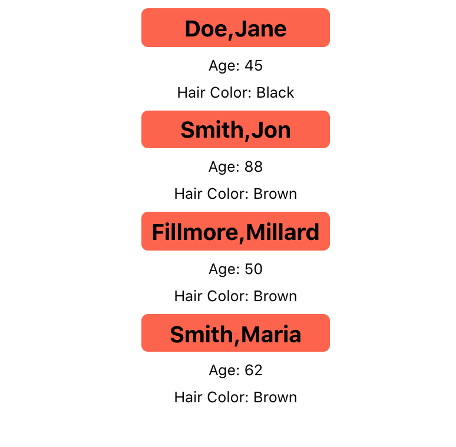

# Prop It Up

This is my Prop It Up homework assignment for the React section of the MERN module.
We had two objectives:

- Create a component to display a persons info on the page
- Call that component repeatedly using different prop values, displaying 4 unique sets of info.

I accomplished both objectives and commented my code

